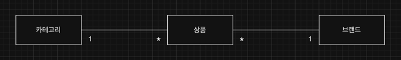

# 무신사 백엔드 과제
지원자: 박준기(junkipark430@gmail.com)
## 기술스택
- 언어 및 프레임워크
  - Java 17, Spring Boot 3.3
- 빌드 관리 도구
  - Gradle 8.7
- 데이터 액세스 및 ORM
  - JPA, QueryDSL
- 템플릿 엔진 
  - Thymeleaf
- 캐싱
  - Caffeine Cache
- 테스트 및 문서화
  - JUnit 5, Mockito, Spring Boot Test
  - Spring REST Docs
- 코드 스타일링
  - Spotless
- 데이터베이스
  - H2 Database

## 도메인 설계

## 간접 참조
상품, 브랜드, 카테고리 간의 관계를 간접 참조 (ID 참조)를 사용하여 도메인 객체 간의 결합도를 낮추고 유연성과 응집도를 높였습니다.
## CQRS 패턴 적용
Command와 Query를 분리하여 명령(command)과 조회(query) 작업의 확장성과 성능을 최적화했습니다.
## 캐시 적용
고성능 캐싱 라이브러리인 Caffeine을 사용하여 데이터베이스 조회 빈도를 줄이고 응답 속도를 향상시켰습니다. 
- 캐시 처리: 고객 조회용 기능에 캐시를 사용하여 성능을 최적화했습니다.
- 캐시 무효화: 관리자 명령(command) 시, 캐시를 무효화(evict)하여 데이터의 최신성을 유지합니다. 상품이나 브랜드가 업데이트되거나 삭제될 때 캐시를 무효화하여 고객에게 최신 데이터를 제공할 수 있습니다.
## 화면 구현
간단하고 빠른 구현을 위해 서버사이드 렌더링 Thymeleaf를 사용하여 화면을 구현했습니다.
## Spotless 적용
코드 스타일을 자동으로 형식화하고 일관성을 유지하기 위해 Spotless를 사용했습니다. 이를 통해 코드 품질을 높이고, 팀 간의 코드 스타일 차이를 줄일 수 있습니다.
## API 문서
RESTful API 문서를 자동으로 생성하기 위해 Spring REST Docs를 사용했습니다. 테스트 코드에서 API 호출을 문서화하여, 실제 사용 예시와 함께 정확하고 신뢰할 수 있는 문서를 제공합니다.
## 테스트 전략
### 도메인, application 서비스, 컨트롤러 유닛 테스트
도메인 로직, Application 서비스 계층, 컨트롤러의 유닛 테스트를 작성하여 각각의 기능이 올바르게 동작하는지 검증했습니다.
### 서비스 통합 테스트
서비스 계층과 데이터베이스 간의 연동을 검증하기 위해 통합 테스트를 작성했습니다.

## 코드 빌드, 테스트, 실행방법
- 빌드
  - ./gradlew clean build
- 실행
  - ./gradlew bootRun
  - home 화면에서 각 메뉴 접속 후, 테스트
- 테스트
  - unit test: domain, application service, controller
  - integration test: service
  - 실행방법: ./gradlew test
- 화면 테스트
  - http://localhost:8080/ 으로 접속(default context path)
- api 문서
  - http://localhost:8080/docs/index.html 접속하여 확인